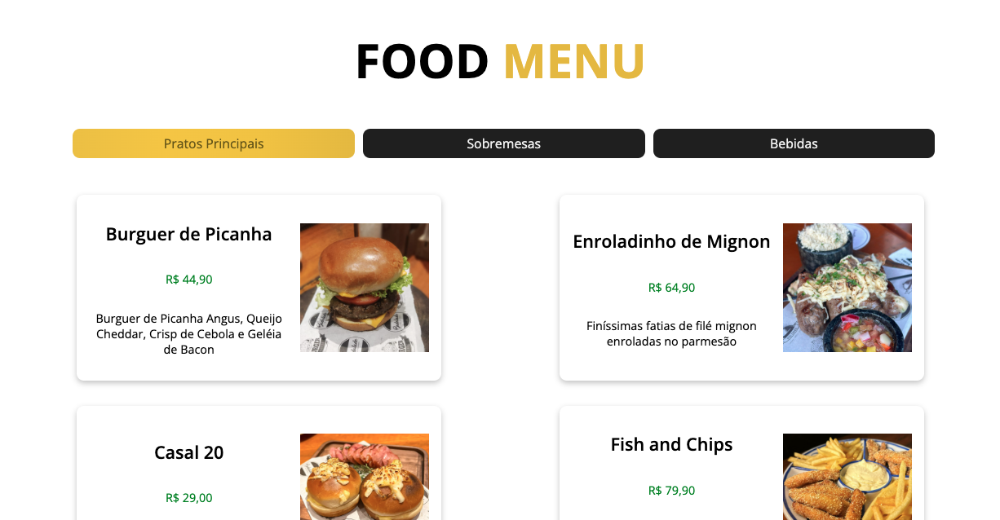
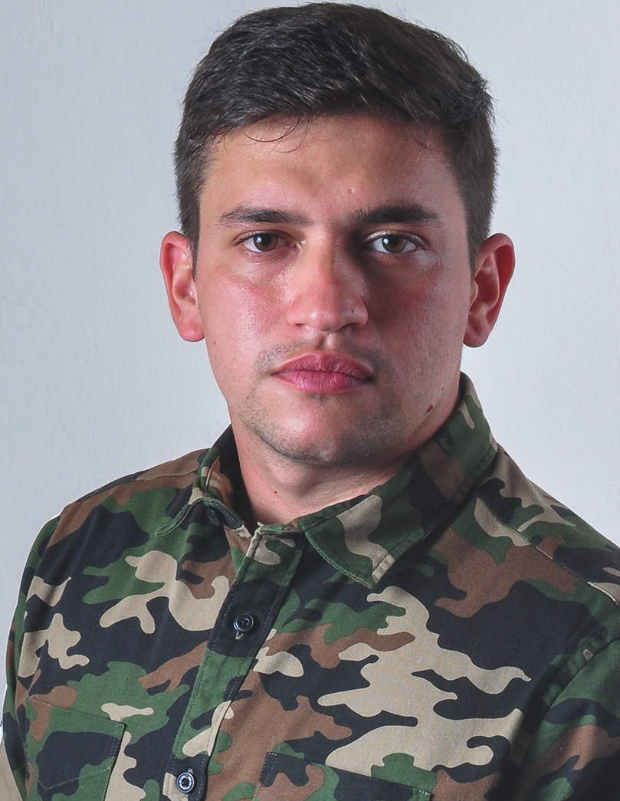

# 💻 Praticando

[🚀 Acesse aqui](https://projeto-menu-rhts1n6py-queiiroz.vercel.app/)

## 💻 Primeiro contato com React

Nesse projeto tive meu primeiro contato com o React depois de 1 ano consolidando minha base em HTML, CSS e JavaScript. Nesse projeto criei uma espécie de cardápio digital.

## 🛠 Tecnologias

- HTML
- CSS
- JavaScript
- React
- Vite
- Node
- Git
- GitHub

<table>
  <tr>
    <td>
     
    </td>
    <td>
      Feito por Gleidson Queiroz.</a> 🙋🏼‍♂️
    </td>
  </tr>
</table>
